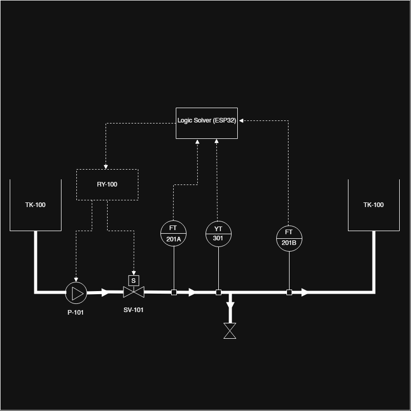

# 🛢️ Automated Pipeline Leak & Vandalism Detection System

## 📌 Project Overview
This repository documents the ongoing development of an advanced, miniature automated process safety system. Designed to simulate Safety Instrumented Systems (SIS) used in the Oil & Gas industry, this hardware prototype detects both **fluid loss (leaks)** and **physical sabotage (vandalism)**. Upon detecting an anomaly, the system autonomously isolates the compromised pipeline section to prevent environmental hazards and transmits real-time telemetry to a remote SCADA dashboard.

## 📐 System Architecture (P&ID)

*Fig 1: ISA-5.1 compliant Piping and Instrumentation Diagram detailing the dual-threat Emergency Shutdown (ESD) logic.*

## ⚙️ Core Engineering Logic

### 1. Hydraulic Monitoring: Mass Balance Principle
The system relies on continuous flow monitoring to detect internal leaks:
* **Flow Sensor A** monitors the input flow rate.
* **Flow Sensor B** monitors the output flow rate.
* **The Logic Solver (ESP32)** continuously calculates: `ΔFlow = Rate A - Rate B`
* If `ΔFlow` exceeds the safe operational threshold, the system triggers an emergency shutdown (ESD) by closing a motorized solenoid valve and cutting power to the pump.

### 2. Structural Monitoring: Edge AI & Vibration Analysis (TinyML)
To detect physical tampering (e.g., oil theft via hacksaws), the system uses on-device Machine Learning (TinyML):
* A **3-Axis Accelerometer** captures raw physical vibration data from the pipeline surface.
* A **Digital Signal Processing (DSP)** block utilizes Fast Fourier Transform (FFT) to convert raw shaking into distinct frequency signatures.
* A **Quantized (int8) Neural Network** running locally on the ESP32 classifies the frequency into three states: `Idle_Normal`, `Vandalism_Hacksaw`, or `Vandalism_Hammer`.
* If vandalism is detected with >50% probability, the system immediately executes an ESD.

## 🧠 Data Engineering Case Study: Model Optimization
During the AI training phase, the model initially struggled to differentiate between a hacksaw and a hammer impact. 

**The Engineering Problem:** Data confusion caused by sensor orientation. Recording the "hacksaw" motion near the edge of the testing surface introduced micro-vertical bounces. To the AI's mathematical filters, these tiny bounces on the Z-axis looked exactly like a hammer strike, causing the overlapping data clusters and false classifications.

**The Solution:** I enforced strict data collection protocols. By purging the "bouncing" data, moving to a flat surface, and re-recording the hacksaw samples focusing strictly on *smooth, continuous friction* (isolating the true physical signature of a saw), the data clusters separated perfectly in 3-dimensional space.
* **Final Model Accuracy:** 100%
* **Resource Cost:** The optimized int8 model runs flawlessly on the ESP32, utilizing only **7% of Dynamic Memory (RAM)** and **30% of Flash Storage**.

## 📡 Communications & IIoT Integration
Industrial systems must report to central command. This prototype features dual-channel communication:
* **Wi-Fi (Primary):** The ESP32 streams live pipeline metrics (Flow Rates, System Status, AI Probabilities) to a cloud-based SCADA dashboard for remote monitoring.
* **GSM (Failover/Alerts):** A SIM800L module is integrated to send immediate SMS text alerts to maintenance crews if the Wi-Fi network fails during an ESD event.

## 🛠️ Hardware Stack
* **Logic Solver:** ESP32 Microcontroller (Dual-core, Wi-Fi enabled)
* **AI Sensor:** 3-Axis Accelerometer / Vibration Sensor
* **Flow Sensors:** 2x YF-S201 Hall Effect Water Flow Sensors
* **Communications:** SIM800L GSM Module
* **Final Control Elements:** 12V Motorized Solenoid Valve (Normally Open), 12V DC Water Pump
* **Switching:** 4-Channel 5V Relay Module

## 🚀 Development Roadmap (8-Month Build)
- [ ] **Phase 1:** Component acquisition, schematic diagramming (P&ID), and basic sensor calibration.
- [x] **Phase 2:** Cloud AI architecture, data engineering, and training the Vandalism Detection Neural Network (100% Accuracy).
- [ ] **Phase 3:** Breadboard prototyping, merging the compiled C++ AI library with the Mass Balance control logic.
- [ ] **Phase 4:** Wi-Fi Dashboard and GSM SMS integration.
- [ ] **Phase 5:** Wet testing with PVC piping and simulated leak/sabotage scenarios.
- [ ] **Phase 6:** Final physical casing and deployment.

## 👨‍💻 Author
**Ebubechukwu (Valentine) Amadi** | Electrical & Electronics Engineering (I&C) | UNILAG  
[Connect with me on LinkedIn](https://www.linkedin.com/in/ebube-ic)
