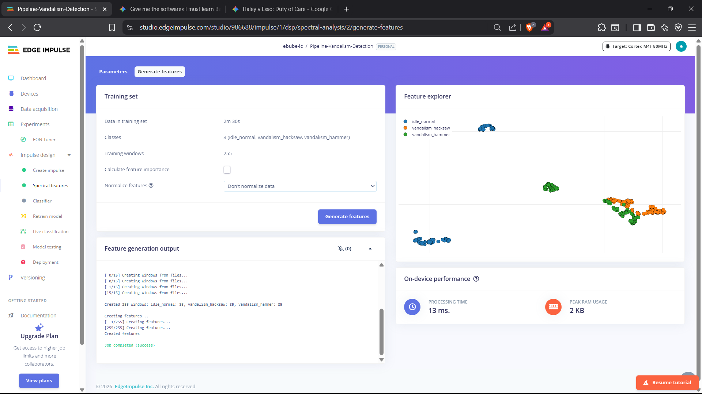

# 🛢️ Automated Pipeline Leak & Vandalism Detection System

## 📌 Project Overview
This repository documents the ongoing development of an advanced, miniature automated process safety system. Designed to simulate Safety Instrumented Systems (SIS) used in the Oil & Gas industry, this hardware prototype detects both **fluid loss (leaks)** and **physical sabotage (vandalism)**. Upon detecting an anomaly, the system autonomously isolates the compromised pipeline section to prevent environmental hazards and transmits real-time telemetry to a remote SCADA dashboard.

## 📐 System Architecture (P&ID)


*Fig 1: ISA-5.1 compliant Piping and Instrumentation Diagram detailing the dual-threat Emergency Shutdown (ESD) logic.*

## ⚙️ Core Engineering Logic

### 1. Hydraulic Monitoring: Mass Balance Principle
The system relies on continuous flow monitoring to detect internal leaks using dual **YF-S201 Hall-Effect Water Flow Sensors**. 
* **Flow Sensor A (FT-201A)**: Monitors the input flow rate via an interrupt-driven digital pin.
* **Flow Sensor B (FT-201B)**: Monitors the output flow rate.
* **The Mathematics**: The ESP32 calculates flow utilizing the standard sensor conversion rate: `Flow Rate (L/min) = Pulse Frequency / 7.5`.
* **The Logic Solver (ESP32)**: Continuously calculates the delta using `ΔFlow = Rate A - Rate B`.
* **ESD Trigger**: If `ΔFlow` exceeds the safe operational threshold, the system triggers an emergency shutdown by closing a motorized solenoid valve (SV-101) and cutting power to the pump (P-101).

### 2. Structural Monitoring: Edge AI & Vibration Analysis (TinyML)
To detect physical tampering (e.g., oil theft via hacksaws), the system uses on-device Machine Learning (TinyML):
* **Sensing Layer**: An **MPU6050 3-Axis Accelerometer (YT-301)** communicates via I2C protocol to capture raw physical vibration data from the pipeline surface.
* **Signal Processing**: A Digital Signal Processing (DSP) block utilizes Fast Fourier Transform (FFT) to convert raw shaking into **399 processed mathematical features**.
* **Classification**: A Quantized (int8) Neural Network running locally on the ESP32 classifies the state into: `Idle_Normal`, `Vandalism_Hacksaw`, or `Vandalism_Hammer`.
* **Safety Protocol**: If vandalism is detected with **>60% probability**, the system immediately executes a hardware-latched ESD.

### 3. Fault Tolerance & Non-Blocking IIoT Architecture
A critical feature of this SIS is its resistance to network failures (Single Point of Failure elimination):
* **Offline Edge Mode**: The ESP32 utilizes an asynchronous, non-blocking network stack. If the Wi-Fi or SCADA connection drops, the microcontroller degrades into an autonomous state, continuing to execute the 14 ms deterministic safety loop without freezing.
* **Remote Simulation Injection (Dry Rig)**: For demonstration and testing, the system features a dynamic memory buffer that allows operators to inject synthetic threat data (Hacksaw/Hammer profiles) remotely via the SCADA dashboard to verify ESD protocols without physical damage.

## 🧠 Data Engineering Case Study: Model Optimization
**🔗 [View the Full AI Model & Dataset on Edge Impulse](https://studio.edgeimpulse.com/public/986688/latest)**

During the AI training phase, the model initially struggled to differentiate between a hacksaw and a hammer impact due to micro-vertical bounces mimicking hammer strikes. By enforcing strict data sanitization protocols, the continuous friction signature of the saw was isolated. 


*Fig 2: DSP mapping showing clean separation of physical states (Idle, Hacksaw, Hammer).*

* **Final Model Accuracy**: 100%.
* **On-Device Performance**: The end-to-end inference cycle runs in just **14 ms**, utilizing a peak dynamic memory of **2.2 KB**.

## 📡 Communications & SCADA Integration
* **Wi-Fi (Primary - Blynk IoT)**: Streams live pipeline metrics, Alarm Status (V0), and AI Confidence (V1) to a mobile dashboard.
* **Remote Reset (V2)**: Authorized personnel can remotely re-arm the system after a latch via a secure Human-in-the-Loop (HITL) button.
* **GSM (Failover/Alerts)**: A SIM800L module is integrated for SMS text alerts if the Wi-Fi network fails during an ESD event.

## 🚀 Installation & Setup
1. Download the `Pipeline_SIS_LogicSolver.ino` file and open it in the Arduino IDE.
2. Install the exported `.zip` library from your Edge Impulse project.
3. **Security Note:** You must insert your own Wi-Fi credentials and Blynk Auth Token at the top of the script:
   ```cpp
   #define BLYNK_AUTH_TOKEN "YOUR_BLYNK_AUTH_TOKEN_HERE"
   char ssid[] = "YOUR_WIFI_SSID_HERE";
   char pass[] = "YOUR_WIFI_PASSWORD_HERE";
